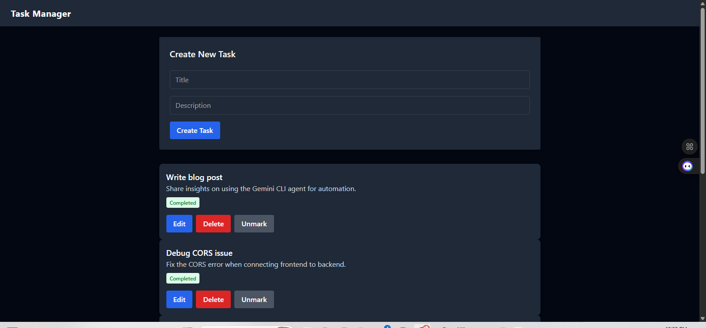

# 📝 Task Management App

A full-featured task management web application built with **React**, **Express.js**, **MongoDB**, and **Tailwind CSS**. It allows users to create, edit, delete, and mark tasks as completed. The UI is built with reusable components and a clean layout structure.

---

## ✨ Features

- ✅ Add new tasks with a title and description
- ✏️ Edit task title and description
- ❌ Delete tasks
- ✔️ Mark and unmark tasks as completed
- 💅 Reusable UI components: Button, Card, Navbar, Footer
- 🧱 Layout component for consistent structure
- 📦 RESTful API integration with Axios
- 🌐 CORS-compliant backend setup

---

## 📁 Project Structure

task-manager-app/
├── backend/ # Express server and MongoDB models
│ ├── model/
│ │ └── TaskModel.js
│ ├── routes/
│ │ └── taskRoutes.js
│ └── server.js
├── frontend/
│ ├── src/
│ │ ├── components/ # Reusable UI components
│ │ │ ├── Button.jsx
│ │ │ ├── Card.jsx
│ │ │ ├── Footer.jsx
│ │ │ ├── Navbar.jsx
│ │ │ └── Layout.jsx
│ │ │ 
│ │ ├── App.jsx
│ │ └── main.jsx
| | └── TaskManager.jsx
├── README.md
└── package.json

---

If hosted on Vercel/Render:

🔗 [Live Demo](https://task-manager-ses9.vercel.app/)


## 🚀 Getting Started

### 1. Clone the repo

```bash
git clone https://github.com/your-username/task-manager-app.git
cd task-manager-app
2. Setup Backen

cd backend
npm install
node server.js
Make sure MongoDB is running locally or update the MongoDB connection string.

3. Setup Frontend

cd frontend
npm install
npm run dev
The frontend will start on http://localhost:5173 and connect to the backend on http://localhost:5000.

🛠️ Technologies Used
Frontend: React, Tailwind CSS, Axios

Backend: Node.js, Express.js, MongoDB, Mongoose

Tools: Vite, Postman

📌 Future Improvements
Add user authentication (JWT)

Due dates and task priority

Filter and search tasks

Responsive mobile layout

🤝 Contributing
Pull requests are welcome. For major changes, please open an issue first to discuss what you would like to change.

📄 License
MIT License. Feel free to use and adapt this project for personal or commercial use.

👨‍💻 Author
Ismail Kabir


